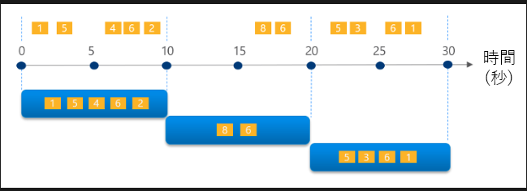
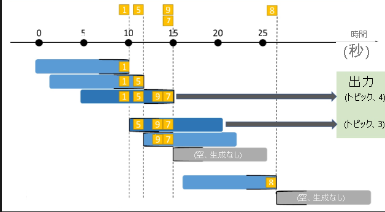
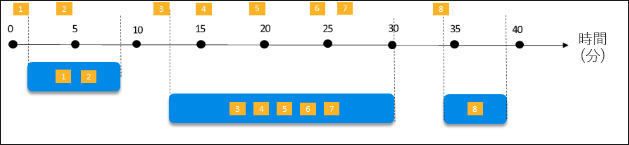
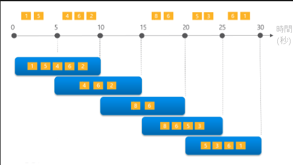

[Microsoft Fabric を使用してデータを取り込む](https://learn.microsoft.com/ja-jp/training/paths/ingest-data-with-microsoft-fabric/)

1. Microsoft Fabric でデータフロー Gen2 を使用してデータを取り込む  
[Microsoft Fabric でデータフロー Gen2 を使用してデータを取り込む](https://learn.microsoft.com/ja-jp/training/modules/use-dataflow-gen-2-fabric/)  
**学習の目標**
- Microsoft Fabricのデータフロー機能について説明する
- データを取り込んで変換するためのデータフローソリューションを作成する
- パイプラインにデータフローを含める

1.1. はじめに  
データフローGen2は複数のソースからデータを取り込んで変換し、クレンジングされたデータを別の宛先に格納するために使用される。  
データパイプラインに組み込むこともBIのデータソースにすることもできる。  


1.2. Microsoft Fabric のデータフロー Gen2 について  
データフローGen2はPower Query Onlineを使用するETLツール  
データフローGen2も目的はETLタスクを実行するための簡単で再利用可能な方法を提供すること  
データの宛先を指定せず変換方法のみ定義した状態でパイプラインに追加し、後続のアクティビティに変換後の状態を渡すことも可能。  
パイプラインでレイクハウスにデータを読み込み、データフローで変換し、そのデータフローをセマンティックとしてレポートのデータソースにすることも可能。  

1.3. Microsoft Fabric のデータフロー Gen2 について詳しく確認する
行レベルセキュリティはサポートしていない。  
クエリの設定ペインに表示されるデータ宛先オプションは、レイクハウス・Warehouse・SQL database・Azure SQL database・Azure Data Explorer・Azure Synapse Analyticsを設定することができる。

1.4. Microsoft Fabric でデータフロー Gen2 とパイプラインを統合する
データフローGen2はパイプラインと組み合わせると変換されたデータに対して塚の操作を実行する必要がある場合に便利  
パイプラインに組み込みデータフローの完了後にスクリプト・ストアドプロシージャの実行・メタデータの取得など追加のアクティビティを実行することも可能。  
データパイプラインはデータフローを実行するためにスケジューリングすることもトリガーによって実行することも可能。パイプラインを使用してデータフローを実行することで手動で実行する必要がなくなる。

2. Microsoft Fabricを使用してプロセスとデータ移動のオーケストレーションを行う
[Microsoft Fabricを使用してプロセスとデータ移動のオーケストレーションを行う](https://learn.microsoft.com/ja-jp/training/modules/use-data-factory-pipelines-fabric/)
**学習の目的**
- パイプライン機能について説明する
- パイプラインでコピーアクティビティを使用する
- 定義済みのテンプレートに基づいてパイプラインを作成する
- パイプラインを実行して監視する

2.1. はじめに  
データパイプラインを用いるとデータの抽出を行い宛先への読み込みに加えて、途中での変換を行う一連のアクティビティを定義できる  ETLプロセスを自動かするために使用される
Azure Data Factoryに似ている  

2.2. パイプラインについて  
データの移動と処理のタスクを時刻するアクティビティがカプセル化している。  
アクティビティには2つのカテゴリがある。  
・データの変換：データコピー、データフローGen2、Notebook、ストアドプロシージャ、データの削除  
・制御アクティビティ：分岐・ループ、変数・パラメータの管理  
アクティビティを順番に接続することでフローを定義する  
  
2.3. データのコピーアクティビティを使用する  
外部ソースからレイクハウスのファイル・テーブルにデータを取り込むのに使用される一般的なアクティビティ  
データソースの状態から変換を挟まずにターゲットにコピーしたい場合、または後続のアクティビティで変換を行う場合に用いる。データに変換を要する場合、または複数のソースからデータをマージする必要がある場合にはデータフローGen2を実行する。  

2.4. パイプラインテンプレートを使用する  
一般的なパイプラインシナリオのテンプレートが用意されており、それをカスタマイズしながら用いることが可能  

2.5. パイプラインを実行して監視する  
[検証]オプションで構成が有効かどうかを確認できる  
実行履歴から個別のアクティビティの実行時間を確認することもできる。

3. Microsoft FabricでApache Sparkを使用する
[Microsoft FabricでApache Sparkを使用する](https://learn.microsoft.com/ja-jp/training/modules/use-apache-spark-work-files-lakehouse/)
**学習の目的**
- Sparkノートブックとジョブに適したシナリオを特定する
- Sparkデータフレームを使用し分析・変換する
- Spark SQLを使用してテーブルとビューのデータのクエリを実行する
- Sparkノートブックで可視化する

3.1. はじめに  
Apache Sparkは大樹のなデータ処理と分析のためのオープンソースの並列処理フレームワークでビッグデータ分析で人気。  

3.2. Apache Sparkの使用にむけて準備を行う  
Sparkは、Sparkプールと呼ぶクラスター内の複数の処理ノード間で作業を調整する分散データ処理フレームワーク  
様々な言語で記述されたコードを実行できる。  

Sparkプールには、2種類のノードが含まれる  
- "ヘッド"ノード: ドライバープログラムを介して分散プロセスを調整する
- "worker"ノード: Executorプロセスが実際のデータ処理タスクを実行する、プールに複数含まれる  

Fabricでは、スタータープールが提供され、即時利用できるが、カスタムSparkプールを作成することもできる。  
カスタム項目は次の通り  
- ノードファミリ: ノードに使用する仮想マシンの種類、メモリ最適化ノードを使用するのが一般的
- 自動スケーリング: ノードを自動的にプロビジョニングにするかどうか、する場合のノードの初期数と最大数
- 動的割り当て: Workerノードに動的にExecutorプロセスを割り当てるか、データ量に基づいてExecutor数が調整され、パフォーマンスが向上する  

Fabricのカスタム環境を作成することで様々な指定をすることができる  
- Sparkランタイム・Pythonパッケージ・Sparkプールの指定・Spark構成プロパティ

3.3. Sparkコードを実行する  
ノートブックを使用またはSparkジョブを定義する  
ジョブ：オンデマンドまたはスケジュールに基づいてスクリプトを実行する、Lambdaみたいな感じ  

3.4. Sparkデータフレーム内のデータを操作する  
Sparkは耐障害分散データセット(RDD)と呼ばれるデータ構造がネイティブで使用されが、構造化データを操作する場合はデータフレームが最もよく使われる。Sparkデータフレームは、pandasデータフレームに似ているが、分散処理環境で動作するように最適化されている。  

データをデータフレームに読み込む際に、明示的にスキーマを指定するとパフォーマンスが向上する。  

Qarquetファイルに書き込むこともできる。  
書き込みの列を指定してパーティションを分けて書き込むこともでき、これによりパフォーマンスが向上する場面がある。  
指定したパーティション分割列の値ごとにサブフォルダが形成され、値ごとにファイルが出力される。  

3.5. Spark SQLを使用してデータを操作する  
Sparkカタログ：ビューやテーブルなど、Spark対応言語のコードとSQLをシームレスに統合できる  

3.6. Sparkノートブックでデータを視覚化する  
ノートブックでdfを表示したりSQLを実行したりするとセルの下に結果のグラフが表示されるため素早く視覚化できる。  
pythonのmatplotlibやseabornライブラリを用いて視覚化をカスタムすることもできる。  

4. Microsoft Fabricのリアルタイムインテリジェンスの使用を開始する
[Microsoft Fabricのリアルタイムインテリジェンスの使用を開始する](https://learn.microsoft.com/ja-jp/training/modules/get-started-kusto-fabric/)
**学習の目的**
- イベントデータのリアルタイムストリームのキャプチャ、分析、可視化、操作が可能なリアルタイムインテリジェンス機能を学ぶ

4.1. はじめに  
データ分析は"バッチデータ分析"と"リアルタイムデータ分析"の2つに大別される。本項目では最小限のコーディングによってリアルタイムデータ分析ソリューションを構築する方法を学ぶ。  
  
4.2. リアルタイムデータ分析とは  
リアルタイムデータ分析は、永続的な一連のデータで構成されるデータ"ストリーム"のインジェスト　と　処理　に基づく。  
リアルタイム分析には次の共通の目的がある。  
- 問題・傾向を報告するためにデータを継続的に分析する
- 今後の昨日強化の計画に生かすため、様々な状況でのシステムの挙動について理解する
- 特定のイベントが発生したときや閾値を超えたときに、アクションやアラートをトリガーする。

○リアルタイムデータ分析のためのストリーム処理の特性
- ストリームは無制限、終わりがなく永続的にデータがストリームに追加される
- ストリーム内のレコードには通常、レコードが関連するイベントがいつ発生したかを示す時間ベースのデータが含まれる
- ストリームデータの集計は、"ウィンドウ"で実行されることが多い。1分あたりの○○など
- 処理結果を用いてリアルタイムの自動化・可視化をサポートしたり、データストアに保持して、他のデータと組み合わせて分析することも可能。

4.3. Microsoft FabricのReal-Time Intelligence  
Fabricのリアルタイムインテリジェンスを用いると以下のことができる。  
- データのキャプチャ、取り込みを行うイベントストリームが作成できる。  
- キャプチャしたデータをイベントハウスに格納する。これには1つ以上のKQLデータベースが含まれる。クエリセットを用いて分析が行える。  
- リアルタイムダッシュボードまたはPower BIで可視化する。  
- アクティベーターを使用して自動アクションをトリガーするアラートを構成する。  
これらのリソースは、リアルタイムハブから管理できる。  

4.4. リアルタイムデータの取り込みと変換  
イベントストリームはキャプチャ・変換・読み込みに使用する。  
データソース：外部サービスやFabricイベントなど  
データ変換：    
　フィルター：フィールドの値に基づきイベントをフィルター  
　フィールドの管理：型の変更や列の追加・削除、名前変更  
　集計：一定期間内にイベントが発生するたびに集計を計算する、データ内の他のディメンションに基づいて集計をフィルター/スライスすることも可能。  
　Group by変換：特定の時間枠内の全てのイベントの集計を計算する  
　和集合：2つ以上のノードを接続、名前と型が同じフィールドを持つイベントを1つのテーブルに統合、一致しないフィールドは削除  
　展開：配列内の値を新しい行に展開  
　結合：2つのストリームデータを一致条件に基づいて結合  
データの同期先：Eventhouse、レイクハウス、派生ストリーム（別のeventstreamにリダイレクト）、Fabric Activator（アクションを自動かするエージェント）、カスタムエンドポイント（外部システムに送信可能）  

4.5. リアルタイムデータの格納とクエリ  
Eventhouseはfabric上での一般的なリアルタイムデータの格納先  
KQLデータベース（データストア）とKQLクエリセットを作成する。  
KQLデータベース内のテーブルには、Kusto照会言語（KQL）を使用可能、読み取り専用。  
時間ベースの要素を使用した大量データに対するクエリ実行に最適化されている。  
ただし、一般的なSQLもサポートしている。  

4.6. リアルタイムデータを可視化する  
リアルタイムダッシュボードの各タイルには、イベントハウス内のテーブルからKQLクエリに基づいて情報を表示可能。ドリルダウンも可能  
Power BIでもKQLデータベースのデータを可視化可能。  

4.7. アクションを自動化する  
Activatorでイベントの自動処理が可能。メール通知やノートブックの実行など。  
Activatorは4つの概念で動作  
①イベント：ストリーム内のレコードはイベントを表す  
②オブジェクト：レコード内のデータは、なにかしらのオブジェクトを表す  
③プロパティ：データ内のフィールドが何を表すか  
④ルール：プロパティ値に基づいてアクションがトリガーされる条件  


5. Microsoft Fabricでリアルタイムイベントストリームを使う  
[Microsoft Fabricのリアルタイムインテリジェンスの使用を開始する](https://learn.microsoft.com/ja-jp/training/modules/explore-event-streams-microsoft-fabric/)
**学習の目的**
- Eventstreamsでソースと宛先を確立する。データの取り込み・変換・ルーティングを行う  
  
5.1. はじめに：3項と重複のため省略  
5.2. イベントストリームのコンポーネント  
イベントストリームは、複数のソースから様々な宛先へのイベントのパイプラインを作成することによって機能する。途中で変換も行うこともできる。  
主なコンポーネントは次の通り  
- ソース：イベントデータの発生源、データ形式とコンシューマーグループを選択することも可能  
- 変換：フィルターや集計など  
- 宛先：イベントデータを格納する場所。

5.3. Eventstreamのソースと宛先  
ソース：Azure Event Hub・IoT Hub・SQL Database CDC・Blob Storageイベント、PostgreSQL/MySQL/Cosmos DB CDC、Google Cloud Pub/Sub、Amazon Kinesis、Confluent Cloud Kafka、Fabricワークスペースイベント、カスタムエンドポイント、サンプルデータ  
宛先：Eventhouse, lakehouse, アクティベーター、 カスタムエンドポイント、派生ストリーム  

5.4. Eventstreamの変換  
変換の種類は以下の通り  
フィルター：フィールドの値やデータ型に応じて条件に一致する値を保持  
フィールドの管理：データ型の追加・削除・変換、フィールドの名前の変更  
集計：一定期間内に新しいイベントが発生するたびに集計する  
Group by：特定の時間枠内のすべてのイベントの集計を計算する。  
和集合：2つ以上のノードを接続し名前・データ型が同じフィールドを持つイベントを1つのテーブルに追加  
展開：配列内の値ごとに新しい行を作成できる  
結合：2つのストリームのデータを一致条件に基づいて結合する  

ウィンドウ関数の種類  
・タンブリングウィンドウ：固定周期で固定ウィンドウ、ウィンドウを重複させない。  
  
・スライディングウィンドウ：固定ウィンドウで、ウィンドウ内のトピック数がルールできめたトピック数を上回れば検出、下回ればスキップ  
  
・セッションウィンドウ：ウィンドウ幅は可変で、アクティビティをいい感じのグループにまとめる  
  
・ホッピングウィンドウ：固定周期で固定ウィンドウ、ウィンドウを重複させる。  
  
・スナップショットウィンドウ：タイムスタンプが同じイベントをグループ化する。

ウィンドウ関数の設定項目は4つのパラメータ  
- ウィンドウ期間：ウィンドウ幅、秒・分・時間・日  
- ウィンドウオフセット（省略可能）：各ウィンドウ間隔の開始・終了を指定した時間分シフトする。  
- グループ化キー：グループ化するイベントデータ内の1つ以上の列(ID列など)  
- 集計関数：各ウィンドウのグループに適用する1つ以上の関数  

6. Microsoft Fabric イベントハウスでリアルタイム データを操作する  
[Microsoft Fabric イベントハウスでリアルタイム データを操作する](https://learn.microsoft.com/ja-jp/training/modules/query-data-kql-database-microsoft-fabric/)  
**学習の目的**  
- イベントハウスを作成する
- Kustoクエリ言語(KQL)を使用してリアルタイムデータのクエリを実行する
- KQLデータベースに具体化されたビューとストアド関数を作成する  

6.1. 初めに  
Eventhouseは大量データのデータストアを備えており、時間ベースのイベントを表すデータに対して最適化されている。  

6.2. Eventhouse, 5.3. KQLを効率的に使用する    
Eventhouseには、1つ以上のKQLデータベースが含まれており、テーブル・ストアドプロシージャ・ビューなどを作成できる。  
データソースには、静的な場所(ローカルファイル・OneLake・Azure Storage）やリアルタイムソース(Azure Event Hubs・Eventstream)  

KQLデータベース内のテーブルに対するクエリ  
Kusto照会言語(KQL)コードまたは構造化クエリ言語(SQL)の制限付きサブセットが使用可能  
|SQL|KQL|
|:--|:--|
|`SELECT * FROM Automotive`|`Automotive`|
|`SELECT TOP 100 * FROM Automotive`|`Automotive \| take 100`|
|`SELECT  trip_id, pickup_datetime, fare_amount FROM Automotive`|`Automotive \| project  trip_id, pickup_datetime, fare_amount`|
|`SELECT  trip_id, pickup_datetime, fare_amount FROM Automotive WHERE fare_amount > 20`|`Automotive \| where fare_amount > 20 \| project  trip_id, pickup_datetime, fare_amoun_t`|
|`SELECT  trip_id, pickup_datetime, fare_amount FROM Automotive WHERE fare_amount > 20 ORDER BY pickup_datetime DESC`|`Automotive \| where fare_amount > 20 \| project trip_id, pickup_datetime, fare_amount \| sort by pickup_datetime desc`|  
|`SELECT  trip_id, pickup_datetime, fare_amount FROM Automotive WHERE fare_amount > 20 ORDER BY pickup_datetime DESC` |`Automotive \| where fare_amount > 20 \| project trip_id, pickup_datetime, fare_amount \| sort by pickup_datetime desc`| 
|`SELECT vendor_id, COUNT(*) AS trip_count FROM Automotive GROUP BY vendor_id`|`Automotive \| summarize trip_count = count() by vendor_id \| project vendor_id, trip_count`|  
|`SELECT vendor_id, COUNT(*) AS trip_count FROM Automotive GROUP BY vendor_id`|`Automotive \| summarize trip_count = count() by vendor_id \| project vendor_id, trip_count`|  
KQLクエリをKQLデータベースで用いるメリット => シンプルさ、パフォーマンス、柔軟性、統合  

6.4. 具体化されたビューとストアド関数  
**具体化されたビュー**  
```KQL
.create async materialized-view with (backfill=true)
TripsByVendor on table Automotive
{
    Automotive
    | summarize trips = count() by vendor_id, pickup_date = format_datetime(pickup_datetime, "yyyy-MM-dd")
}
```
オプションを付けてビューを設定すると、既存のデータを取り込みビューを作成する。  

**ストアド関数**  
```KQL
.create-or-alter function trips_by_min_passenger_count(num_passengers:long)
{
    Automotive
    | where passenger_count >= num_passengers 
    | project trip_id, pickup_datetime
}
```  
関数にはパラメータを指定できるため、変数値を使用して同じクエリを繰り返すことができる。  

