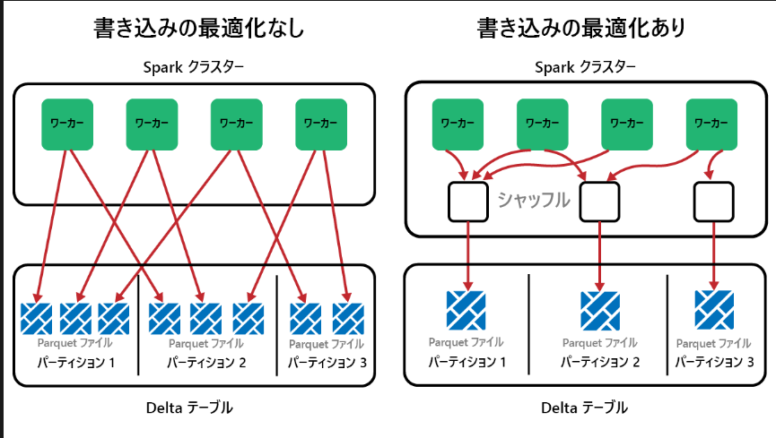
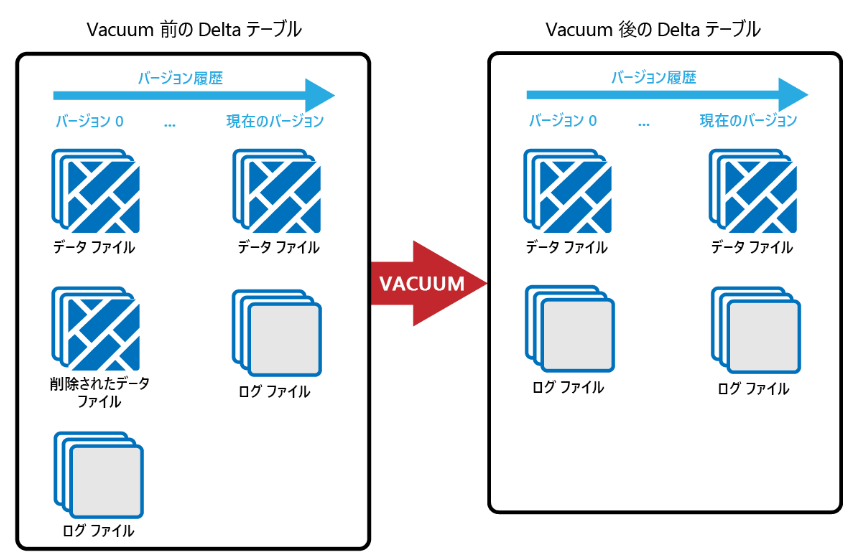

[Microsoft Fabric を使用してレイクハウスを実装する](https://learn.microsoft.com/ja-jp/training/paths/implement-lakehouse-microsoft-fabric/)  

1. Microsoft Fabric を使用したエンドツーエンドの分析の概要  
[Microsoft Fabric を使用したエンドツーエンドの分析の概要](https://learn.microsoft.com/ja-jp/training/modules/introduction-end-analytics-use-microsoft-fabric/)    
**学習の目標**
- Fabricエンドツーエンドの分析について説明する  

1.1. はじめに  
Fabricはエンドツーエンドの分析プラットフォーム、単一環境でのデータの取り込み、格納、処理、分析が可能な一連の統合サービスが用意されている。  

1.2. エンドツーエンドの分析を調べる  
全てのデータがOneLakeに1つのオープン形式で格納されている。  
OneLakeには、プラットフォーム内の全ての分析エンジンからアクセスできる。  
OneLakeはAzure Data Lake Storage(ADLS)上に構築され、Delta, Parquet, CSV, JSONなど任意のファイル形式でデータを格納できる。  
OneLakeのショートカット機能は、既存のクラウドデータを素早くソース化でき、同じソースからデータを派生させることができる。  

1.3. データチームとMicrosoft Fabric  
データエンジニア：複雑なデータ処理を実施  
データアナリスト：ビジネスに適したデータを効果的に表示できるようにデータソースをキュレーションして提供  
従来の開発プロセスでは、この2者の役割の違いにより多くのコミュニケーションコストがかかる  
Fabricは開発プロセスを変革して、ロール間での作業の重複を避けつつ、必要なスキルを柔軟に実行できるようになる  

1.4. Fabricを有効にして使用する  
Fabric or PP管理者 or M365管理者が管理センターにて有効化する  

2. Microsoft Fabricでのレイクハウスの概要  
[Microsoft Fabricでのレイクハウスの概要](https://learn.microsoft.com/ja-jp/training/modules/get-started-lakehouses/)
**学習の目標**
- レイクハウスのコア機能を説明し、作成する
- データを取り込み、クエリを実行する  

2.1. 初めに  
レイクハウスはスケールブルなストレージとデータウェアハウスのデータに対するクエリ実行を兼ね備えた統合プラットフォーム。  

2.2. レイクハウスを探索する  
レイクハウスは、データレイクの柔軟性とSQLベースの分析機能であるデータウェアハウスをくみあわせたもの。  
**利点**  
- 大規模データの処理が可能で、機械学習や予測モデリング分析をサポートする  
- "スキーマオンリード形式"(自分で必要に応じてスキーマを定義)で編成  
- ACIDトランザクションがDelta Lake形式でサポート

2.3. レイクハウスを使用する  
レイクハウスを作成すると、ワークスペースに3つの項目が自動生成される。  
- レイクハウス：ショートカット、テーブル、フォルダー、ファイルを含む
- セマンティックモデル(規定)：BI開発者向けの簡単なデータソース
- SQL分析エンドポイント：SQLを使用してクエリを実行するための読み取り専用アクセスポイント

レイクハウスにデータを取り込む  
ファイルアップロード、データフローgen2、ノートブック、パイプラインのコピーアクティビティにより、ファイルやテーブルに直接データを読み込むことができる。  
別のストレージアカウントや別のクラウドプロバイダーのストレージに保存したままショートカットにより統合することもできる。レイクハウスとKQLデータベースの両方に作成でき、レイク内のフォルダーとして表示される。  
  
2.4. レイクハウス内のデータを探索して変換する  
省略  

3. Microsoft FabricでApache Sparkを使用する
[Microsoft FabricでApache Sparkを使用する](https://learn.microsoft.com/ja-jp/training/modules/use-apache-spark-work-files-lakehouse/)  
1.3と同じため省略  

4. Microsoft FabricでDelta Lakeテーブルを操作する  
[Microsoft FabricでDelta Lakeテーブルを操作する](https://learn.microsoft.com/ja-jp/training/modules/work-delta-lake-tables-fabric/)  
**学習の目的**  
Sparkを用いてデルタテーブルを作成・管理・最適化、クエリと変換を行う  

4.1. 初めに  
LakehouseのテーブルはApache Sparkでよく用いられるLinux Foundation Delta Lakeテーブル形式に基づいており、バッチデータ・ストリーミングデータのリレーションデータベース機能を有効にする。  

4.2. Delta Lakeについて理解する  
LakehouseのテーブルはDeltaテーブル、DeltaテーブルはDelta形式で格納されているデータファイルに対するスキーマの抽象化。  
テーブルごとに、Parquetデータファイルを含むフォルダーとトランザクションの詳細がJSON形式で記録されている_delta_Logフォルダーが格納される。  

Deltaテーブルの利点  
- CRUD(作成、読み取り、更新、削除)操作のサポート
- ACIDトランザクションのサポート  
- データのバージョン管理が可能
- バッチデータとストリーミングデータをどちらもサポート  

4.3. デルタテーブルを作成する  
マネージドテーブル：メタストア内のテーブル定義ともとになるデータファイルの両方がlakehouseのSparkランタイムによって管理される    
`df.write.format("delta").saveAsTable("mytable")`  
外部テーブル：テーブル定義がメタストアに作成されるが、ParquetファイルとJSONログファイルは指定した場所に格納  
`df.write.format("delta").saveAsTable("myexternaltable", path="Files/myexternaltable")`
lakehouseメタストアから外部テーブルを削除しても関連するデータファイルは削除されない  

テーブルを作成する方法は、dataframeから・仕様（テーブル名・列名・型を指定）・SQLから作成可能  

4.3. デルタテーブルを最適化する  
Parquetファイルを不変であるため、更新削除のたびに新しいファイルが書き込まれ、その結果、多数の小さなファイルが作成され、クエリの低速化が発生する微小ファイル問題が発生する可能性がある。  

**OptimazeWrite関数**  
書きこみを少数の大きなファイルにまとめる機能。規定でfabricではON。
  

**最適化**  
小さいParquetファイルを大きなファイルにまとめるメンテナンス機能、圧縮率向上とノード間の出0汰分散を効率化する  
レイクハウスのテーブルメニューから実行可能  

**Vオーダー機能**  
optimaze実行時に選択できるfabricのparquet向けに設計された機能で読み込みを最適化する。  
fabricでは規定で有効になっており、データの書き込み時に適用される。  
しかし、15%程のオーバーヘッドがあるため、読み込みが少なく書き込みが多いテーブルではメリットが薄くなるため無効化したほうがいい。  

**VACUUM**  
データファイルのうち、トランザクションログで現在参照されておらず、指定された保持期間より風莉ものを削除する。  
既定は7日間でそれより短い期間は指定できない。  
実行するとタイムトラベルで保持期間以前までさかのぼることはできなくなる。  
アドホックでもスケジュール実行もできる。  
  

**パーティション分割**
微小ファイル問題が悪化する可能性もあるため、次の観点で評価して実施するか検討する  

分割が効果的になる場合  
- データ量が非常に多い
- テーブルを少数の大きいパーティションに分割できる

分割が効果的にならない場合
- データ量が少ない
- 分割列のカーディナリティが大きく、パーティション数が多くなる
- 1つの分割列に複数のレベルが発生する可能性がある  

4.4. デルタテーブルを操作する  
`DESCRIBE HISTORY products`  
でテーブル履歴を表示し、  
`df = spark.read.format("delta").option("versionAsOf", 0).load(delta_path)`
のように過去のバージョンのデータを取得することも可能  

4.5. ストリーミングデータにデルタテーブルを使用する  
DeltaテーブルはSpark Structured Streamingのソースまたはシンクとして使用できる  
